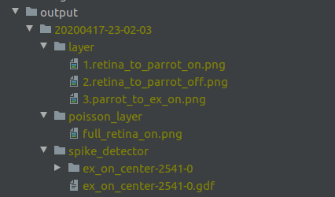
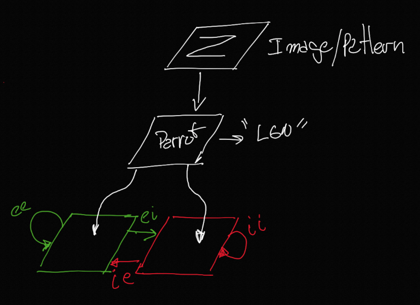

# Learning Spiking Neural Networks

This readme file purpose is a recopilation of concepts,
links, paper, resources and others as recall/information point.

## Papers

- [Izhikevich Spiking neural networks basic concepts where the differential equations are explained and described.](./papers/Izhikevich-2003.pdf)
- [first paper explaining the concept of first spike.](./papers/DelormeNN2001.pdf)
- [Overview about SSN](./papers/Masquelier-NeuralNetworks-2019.pdf)
- [categorization using first Spike](./papers/mozafari_m_18_1b.pdf)
- [SSN STPD-MNSIT database Number detection.](./papers/Spiking-STDP-MNIST.pdf)
- [Arquicture used for Spiking-STDP-MNIST.pdf paper](./papers/Recurrent-Sipiking-fninf-12-00079.pdf )

## Tools

https://www.nest-simulator.org/

## Tutorials

- [Basic one](https://www.nest-simulator.org/part-1-neurons-and-simple-neural-networks/)
- [Complementary to first tutorial.](https://www.nest-simulator.org/wp-content/uploads/2015/02/NEST_by_Example.pdf) 
- [Topology (how to connect neurons)](https://www.nest-simulator.org/wp-content/uploads/2015/04/Topology_UserManual.pdf) 

## Basic concept for Computer guys/gals like me :-)

- https://www.docsity.com/es/capitulo-51-del-guyton-el-ojo-ii-neurofisiologia-central-de-la-vision/2293420/


## Creating Environment.
```
wget https://repo.anaconda.com/archive/Anaconda3-2019.10-Linux-x86_64.sh
bash ./Anaconda3-2019.10-Linux-x86_64.sh

git clone https://github.com/juanmav/spiking.git
cd spiking
apt-get install libgl1-mesa-glx libegl1-mesa libxrandr2 libxrandr2 libxss1 libxcursor1 libxcomposite1 libasound2 libxi6 libxtst6 libopenblas-dev
conda create -n spiking python=3.6
conda install -c conda-forge ffmpeg pypng nest-simulator=*=mpi_openmpi* jupyterlab matplotlib pillow python-dotenv mpi4py
# for local development install nest without openmpi
conda install -c conda-forge nest-simulator mpi4py
python testPlot.py

conda install -c conda-forge python-dotenv
```

The last command should create two images (test0.png and test1.png) if it
does the installation was successful.

## Some stuff, how things are "connected"

[how connections are](assets/receptivefield_v1_connection.jpeg)

## To run the main simulation

> python main.py

You can check results on the `./output` folder.


### Output folder layout



### Simplified 



## TODO

- Improve LayerRecorder
- Move functions from main.py to utils and/or another tools.
- Make parameters logs for each run. (connections, frequencies, array size, etc etc).
- Document `./output` folder layout.


https://en.wikipedia.org/wiki/Cortical_spreading_depression